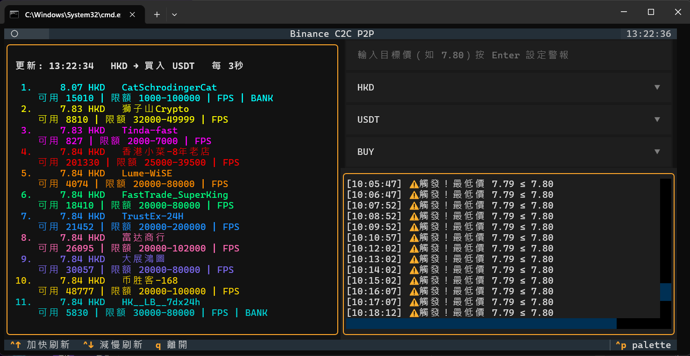
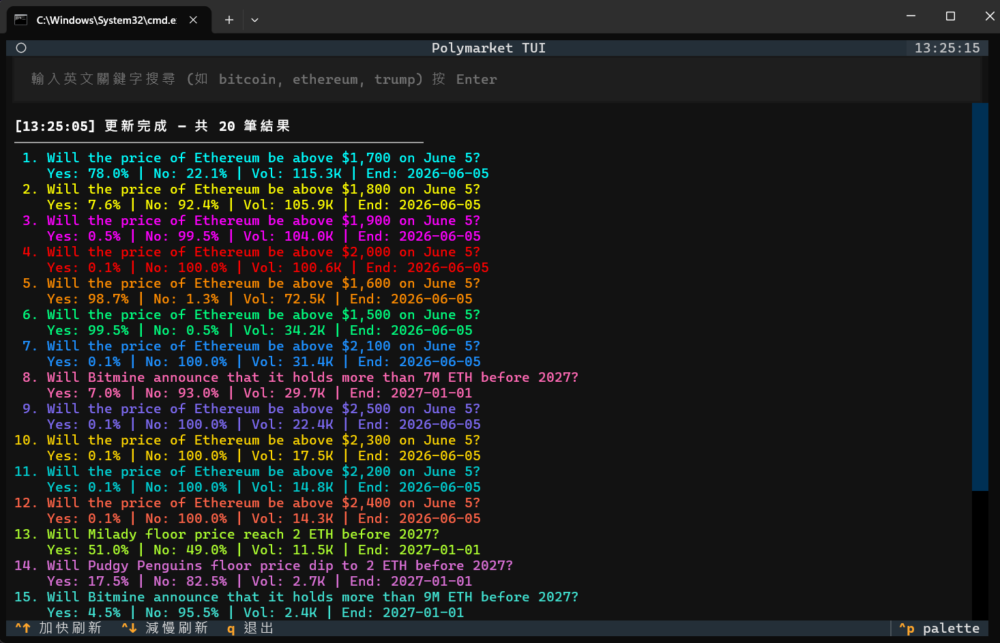

# TUI_FinTools

A collection of lightweight terminal-based financial monitoring tools built with Python [Textual](https://github.com/Textualize/textual). No web browser needed — everything runs in your terminal.

## Tools

| Tool | File | Description |
|------|------|-------------|
| 🏦 Binance P2P | `binance_p2p.py` | Monitor Binance C2C/P2P exchange rates with price alerts |
| 🔮 Polymarket | `polymarket.py` | Search and track prediction market odds |
| 💰 Bitfinex Lending | `bitfinex_lending.py` | Automated margin funding bot (dry-run & live) |
| 💱 Forex Rates | `forex.py` | Real-time fiat currency exchange rates |
| 📈 Crypto Prices | `crypto_prices.py` | Top 40 cryptocurrency spot prices from Binance |
| 🇺🇸 US Stocks | `us_stocks.py` | Major indices & stock quotes from Yahoo Finance |

## Screenshots





## Requirements

- Python 3.11+
- Windows / macOS / Linux

## Installation

```bash
git clone https://github.com/wing9897/TUI_FinTools.git
cd TUI_FinTools
pip install textual requests aiohttp
```

## Usage

Each tool is a standalone single-file application. Just run:

```bash
python binance_p2p.py          # Binance P2P monitor
python polymarket.py           # Polymarket prediction markets
python bitfinex_lending.py     # Bitfinex lending bot
python forex.py                # Fiat exchange rates
python crypto_prices.py        # Crypto spot prices
python us_stocks.py            # US stock indices
```

### Bitfinex Lending Bot Setup

```bash
cp loanbot_data/config.example.toml loanbot_data/config.toml
# Edit config.toml with your settings
python bitfinex_lending.py
```

## Keyboard Shortcuts

All tools share common shortcuts:

| Key | Action |
|-----|--------|
| `q` | Quit |
| `Ctrl+↑` | Speed up refresh |
| `Ctrl+↓` | Slow down refresh |

### Binance P2P additional shortcuts

| Key | Action |
|-----|--------|
| Select widgets | Switch fiat / crypto / buy-sell direction |
| Input field | Set price alert (e.g. `7.80`) |

## Data Sources

| Tool | API | Auth Required |
|------|-----|---------------|
| Binance P2P | Binance P2P Search API | No |
| Polymarket | Gamma API `/public-search` | No |
| Bitfinex Lending | Bitfinex Public + Auth REST v2 | API key for live mode |
| Forex | [Frankfurter](https://frankfurter.dev/) (ECB data) | No |
| Crypto Prices | Binance Spot `/ticker/24hr` | No |
| US Stocks | Yahoo Finance Chart API | No |

## License

MIT
